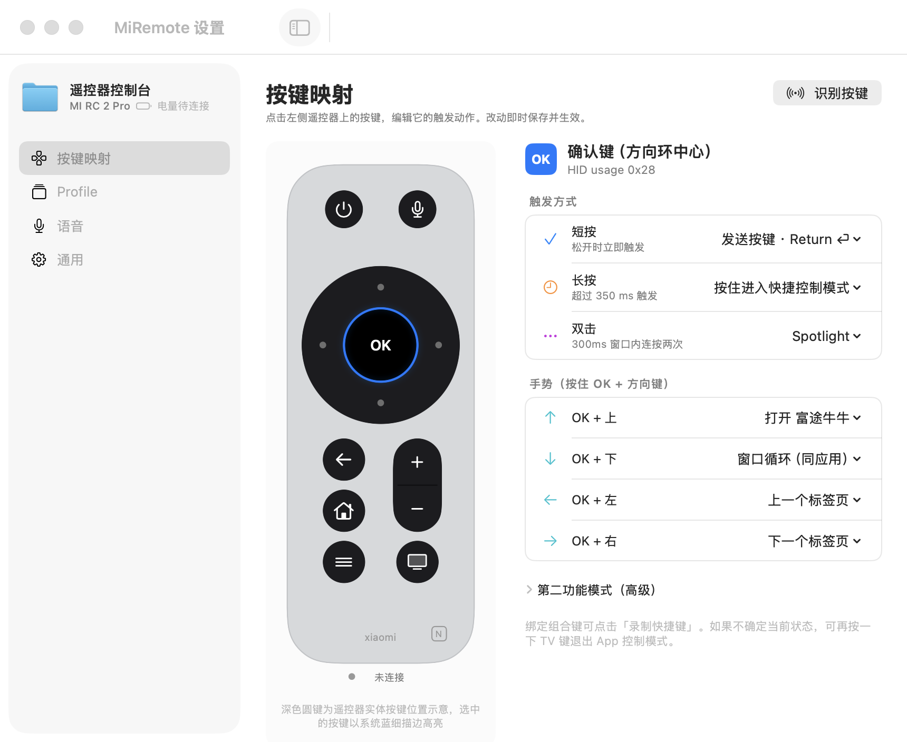

<div align="center">

# MiRemote

**Xiaomi Bluetooth Remote 2 Pro → a full macOS control console**
Command AI to write code from your couch: hold the voice key and talk to type directly; 13 keys mapped to any Mac action.

[](https://github.com/godarrenw/mi_remote_control/actions/workflows/ci.yml)
[](https://github.com/godarrenw/mi_remote_control/releases)
[](https://www.apple.com/macos/)
[](https://swift.org)
[](LICENSE)
[](Package.swift)

[中文](README.md) · **English**



</div>

> **MiRemote** turns a Xiaomi Bluetooth Remote 2 Pro into a full macOS controller. Hold the
> voice key and talk — your speech is typed into the focused field via a private ATVV audio
> channel and an IME. The 13 physical keys map to keystrokes, window switching, tab jumping,
> a mouse mode, per-app profiles, and an "approve/reject" layer for AI coding agents. Native
> Swift 6, zero third-party dependencies.

---

## Why this exists

A remote you can use lying on the couch to drive an AI agent in your terminal: talk to write
code, use the D-pad to scroll results, one key to approve/reject the agent's changes. This
Xiaomi remote is cheap, feels great, and has a microphone. Over Bluetooth, its keys and voice
are two independent channels — perfect for a Mac to fully take over.

## Features

- **Voice input** — hold the voice key and talk to the remote; text lands in the focused
  field. It flows through the remote's built-in mic → ATVV private GATT → IMA ADPCM decode →
  BlackHole virtual audio device → Doubao IME, all automatically.
- **13 keys × multiple triggers** — every key supports tap / hold / double / layer / gesture
  (OK + direction), squeezing dozens of action slots out of one remote. The default config
  has **zero chord combos** (fully serialized, one-thumb operation); simultaneous-press
  gestures remain available for power users to configure.
- **App control mode** — the TV key enters a per-app advanced layer with a HUD hint;
  direction / OK / back / volume ± then run that app's dedicated actions inside the mode.
- **AI approval layer** — in terminal apps, OK = approve, back = reject, volume ± = switch
  agent, menu = Shift+Tab; tailored to AI coding agents' confirmation flow.
- **Window switcher** — the menu key pops an overlay; left/right selects a window, up/down
  widens the scope (current app → all apps), OK confirms, back closes.
- **Self-healing health checks** — `--doctor` diagnoses and fixes common issues with
  permissions, BlackHole, and leftover key mappings in one shot.
- **Preset library** — built-in profiles for Ghostty / WeChat / browsers / video players,
  with an overlay-inheritance model, one-click import, and JSON export for sharing.
- **Zero dependencies** — all native frameworks (CoreBluetooth / IOKit / CoreGraphics /
  AVFoundation / SwiftUI); no third-party packages.

## Architecture at a glance

```
┌─────────── Remote (BLE) ───────────┐
│  Channel 1: keys = standard HID     │
│  Channel 2: voice = ATVV GATT svc   │
└───────────────┬───────────────────┘
                │
┌───────────────▼─── MiRemote ──────────────────────────┐
│ HIDEngine        CoreBluetooth/ATVV                    │
│ (hidutil relay    (handshake→ADPCM decode→PCM)         │
│  + CGEventTap)         │                               │
│      │                 │                               │
│ MappingEngine     AudioBridge                          │
│ (layers/hold/dbl/  (PCM→BlackHole virtual device)      │
│  gesture/per-app)      │                               │
│      │                 ▼                               │
│ ActionSystem      Doubao IME picks BlackHole as mic→text│
│ (keys/window/tab/                                      │
│  focus/mouse/macro/script)                             │
└────────────────────────────────────────────────────────┘
```

On the BLE link, keys and voice are two non-interfering channels: keys go over standard HID,
remapped at the device level with `hidutil` to a side-effect-free relay key, then captured and
parsed by a `CGEventTap`; voice goes over the ATVV private GATT service, connected directly by
CoreBluetooth without the system taking it over. See [DESIGN.md](DESIGN.md) (Chinese).

## Quick start

```bash
# 1. Build (Command Line Tools only, no full Xcode needed)
./build.sh
.build/miremote --self-test      # the built-in self-test should be all green

# 2. Package (first time, create the fixed signing cert below first)
./scripts/setup-signing.sh       # one-time: create the "MiRemote Dev" self-signed cert
./scripts/package.sh             # assemble + sign .app → dist/
./scripts/make-dmg.sh            # build a DMG → dist/MiRemote-<version>.dmg

# 3. First launch: the wizard walks you through Bluetooth / Input Monitoring / Accessibility
```

> Use `./build.sh` (direct `swiftc`) rather than `swift build`: CLT ships without XCTest, so
> tests are compiled into the binary and run via `--self-test`. To preview just the GUI, use
> `.build/miremote --ui-preview`.

## Key cheat sheet

| Key | Tap | Hold |
|---|---|---|
| D-pad ↑↓←→ | Move cursor | Continuous move |
| OK | Return | — (customizable; some app presets = Ctrl+C, etc.) |
| Back | Delete / close overlay | — |
| Home | Show desktop | Mapping tutorial overlay for current app |
| Menu | Window switcher overlay | Full system function-menu overlay |
| TV | Enter/exit App control mode | App wheel (release after popping; direction to pick an app, OK / press TV again to confirm, back to cancel, auto-closes in 3s) |
| Volume ± | Volume (inside control mode = prev/next) | Continuous adjust |
| Voice | Hold to talk → text | — |
| Power | Display sleep | Toggle mouse mode (D-pad moves pointer, OK = click) |

**Lost? Hold the menu key for 1.5s = escape hatch**: no matter which layer you're in or which
overlay is open, it force-clears all layers, exits App control mode, and closes every overlay,
returning to the base state (hardcoded fallback, unaffected by config).

Layer-active / mouse-mode / voice-recording — all three hidden states are shown in sync via the
menu-bar icon color and an on-screen corner badge. The double-tap window defaults to 250ms and
only applies to keys with a configured double-tap action (e.g. the TV key in the Zoom preset);
all other keys respond to a short press with zero delay. Full trigger model and default config
are in [DESIGN.md §3](DESIGN.md) (Chinese).

## Screenshots


_(voice-typing demo GIF to come)_

## FAQ

**Keys stopped working after an upgrade?** Expected, not broken: MiRemote is not Apple-notarized,
so **every time you upgrade to a new version, macOS asks you to re-authorize once** (System
Settings → Privacy & Security → Input Monitoring / Accessibility — remove MiRemote and re-check
it). It takes about 30 seconds, and **your key settings are preserved** (the config file is
unaffected by upgrades). Building from source is the exception: recompiling locally with the
fixed `MiRemote Dev` cert + fixed bundle id keeps permissions; ad-hoc signing loses them every
time, which is why `package.sh` fails hard rather than falling back when the cert is missing.

**Why does voice need BlackHole?** The remote mic's audio is first decoded to PCM, which needs a
virtual audio device to feed the IME as a microphone. After installing
[BlackHole 2ch](https://existential.audio/blackhole/) (free), set the microphone to BlackHole 2ch
in the Doubao IME. It is not set as the system default device and does not affect normal calls.

**Remote/keyboard keys misbehaving after quitting?** MiRemote clears the `hidutil` relay mapping
on quit; if an abnormal exit leaves it behind, run
`hidutil property --set '{"UserKeyMapping":[]}'` in a terminal to restore.

**D-pad drops characters during Secure Input?** Known limitation: during password entry (Secure
Event Input) the system bypasses `CGEventTap` but the `hidutil` mapping still applies, so the
remote's D-pad may leak the relay key into the foreground (a real keyboard is unaffected). v1
accepts this limitation.

## Install (distribution build)

If someone hands you a `.dmg` or `.zip`:

1. Open the DMG and drag `MiRemote.app` into Applications; or unzip and drag it in.
2. **First open**: right-click (or Control-click) MiRemote.app → Open → Open again. Double-clicking
   shows "cannot verify developer" (not notarized) — that's normal; right-click to open. If still
   blocked, go to System Settings → Privacy & Security and click "Open Anyway" at the bottom.
3. Grant the three permissions in the wizard — Bluetooth / Input Monitoring / Accessibility. If a
   change doesn't take effect, quit and relaunch once (note: clicking the red window button only
   closes the window, not the app — choose Quit from the menu-bar icon, then relaunch).
4. **Every new version asks you to re-authorize once** (~30s, settings preserved) — this is the
   normal security behavior for a non-notarized app; see the FAQ above.
5. Remote won't connect: hold **Home + Back for 3s** until the indicator blinks to enter pairing,
   then connect it in System Bluetooth; don't run Xiaomi's official "Remote Assistant" at the same
   time (it grabs the device).

Voice typing additionally needs BlackHole 2ch and the Doubao IME; see the FAQ above.

<!-- Homebrew tap (planned for v2):
brew install --cask godarrenw/tap/miremote -->

## Roadmap

This is the v0.1.0 public preview; the core voice pipeline and key engine are proven on real
hardware. What's next:

- **Homebrew cask distribution** — one-line `brew install --cask`, no more right-click-to-open.
- **Apple notarization** — once a developer account is available, notarize builds to remove the
  "re-authorize on every upgrade" friction.
- **Key self-learning** — a "press a key to identify it" flow in the UI so the usage table adapts
  to different firmware from measured reports.
- **More built-in presets** — profiles for video / meetings / reading, open to community PRs.
- **Robustness polish** — narrow known limitations like the Secure-Input D-pad leak, expand
  fault-injection coverage.

Full milestones and design trade-offs are in [DESIGN.md §9](DESIGN.md) and
[TESTPLAN.md](TESTPLAN.md) (Chinese).

## Acknowledgments

- [open-voice-bridge](https://github.com/) — open-source reference for the ATVV protocol and IMA
  ADPCM decoding.
- [BlackHole](https://existential.audio/blackhole/) — free open-source virtual audio device (GPLv3).

## License

[MIT](LICENSE) © MiRemote contributors
